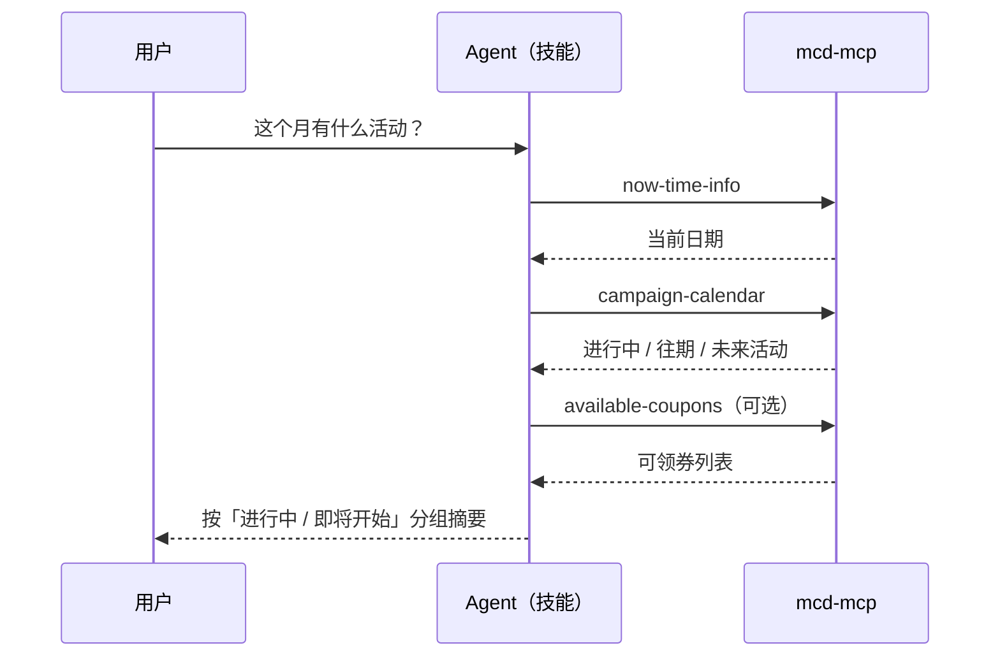
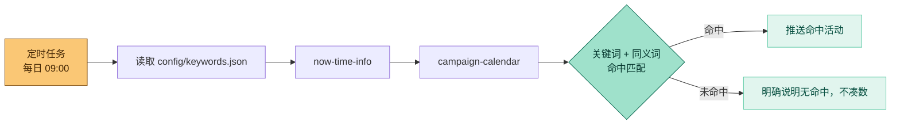
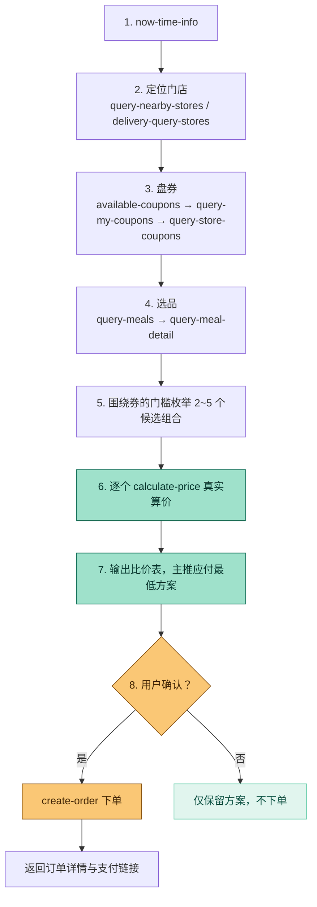

# MCP 集成说明

本文档说明 `mcd-cn-assistant` 实际使用的**麦当劳 MCP Server**、**Tool**、**调用流程**与**业务价值**。

---

## 一、使用的 MCP Server

| 项目 | 值 |
|---|---|
| Server 名称 | `mcd-mcp` |
| 接入地址 | `https://mcp.mcd.cn` |
| 提供方 | 金拱门（中国）有限公司（麦当劳中国） |
| 传输协议 | Streamable HTTP（不支持 WebSocket） |
| 鉴权方式 | 请求头 `Authorization: Bearer <MCP_TOKEN>` |
| 支持版本 | MCP 协议 `2025-06-18` 及之前版本 |
| 工具总数 | 36 个（服务版本 1.0.9） |
| 限流 | 每 Token 600 次/分钟，超限返回 `429` |
| 服务范围 | 中国大陆（不含港澳台） |

本项目**只接入官方远程托管服务**，未使用任何第三方代理地址，不含任何本地 MCP 进程。脱敏配置见 [`mcp-config.example.json`](./mcp-config.example.json)（仅使用环境变量占位符 `${MCD_MCP_TOKEN}`）。

---

## 二、实际使用的 Tool

按"职责"分两类标注：**只读**（查询，可自主调用）与**写操作**（改变账户状态或产生费用，必须先经用户明确同意）。

### 2.1 能力一 · 最新活动推送

| Tool | 用途 | 类型 |
|---|---|---|
| `now-time-info` | 获取当前完整时间，作为一切日期推理的基准 | 只读 |
| `campaign-calendar` | 查询当月营销活动日历（进行中 / 往期 / 未来） | 只读 |
| `available-coupons` | 麦麦省当前可领取的优惠券列表 | 只读 |
| `query-my-coupons` | 用户账户下已有的优惠券 | 只读 |

### 2.2 能力二 · 关键词关注推送

| Tool | 用途 | 类型 |
|---|---|---|
| `now-time-info` | 取得当前日期 | 只读 |
| `campaign-calendar` | 拉取当月活动作为关键词匹配语料 | 只读 |
| `available-coupons` | 补充券类活动信息 | 只读 |

> 关键词匹配、同义词扩展、去重与推送文案组织由技能本地完成，不额外消耗 MCP 调用。

### 2.3 能力三 · 最优惠点餐

| 阶段 | Tool | 用途 | 类型 |
|---|---|---|---|
| 定位门店 | `query-nearby-stores` | 按地址查附近可到店取餐的门店 | 只读 |
| 定位门店（外送） | `delivery-query-addresses` | 查询用户已保存的配送地址 | 只读 |
| 定位门店（外送） | `delivery-query-stores` | 按收货地址查可配送门店 | 只读 |
| 定位门店（外送） | `delivery-create-address` | 新增配送地址 | **写操作** |
| 团餐 | `query-meal-assistance` | 查询门店支持的助餐服务 | 只读 |
| 盘券 | `available-coupons` | 麦麦省可领券 | 只读 |
| 盘券 | `auto-bind-coupons` | 一键领取麦麦省全部可领券 | **写操作** |
| 盘券 | `query-my-coupons` | 账户已有券 | 只读 |
| 盘券 | `query-store-coupons` | 当前门店可用券 | 只读 |
| 选品 | `query-meals` | 门店在售菜单（分类 / 编码 / 标签 / 优惠价） | 只读 |
| 选品 | `query-meal-detail` | 套餐组成、可替换与换购选项 | 只读 |
| 算价 | `calculate-price` | 按商品列表（可含券）计算商品金额 / 配送费 / 优惠 / 应付总价 | 只读 |
| 下单 | `create-order` | 创建订单，返回订单详情与支付链接 | **写操作** |

### 2.4 辅助能力

| Tool | 用途 | 类型 |
|---|---|---|
| `list-nutrition-foods` | 餐品营养成分，用于热量 / 营养搭配场景 | 只读 |
| `query-order` / `order-list` | 查订单进度与近期历史订单 | 只读 |
| `cancel-order` | 取消订单 | **写操作** |
| `query-my-account` | 积分账户信息 | 只读 |
| `mall-points-products` / `mall-product-detail` | 麦麦商城商品与详情 | 只读 |
| `mall-create-order` | 积分兑换商品下单 | **写操作** |
| `mall-order-list` / `mall-order-detail` | 商城订单查询 | 只读 |
| `query-lottery-info` | 积分抽奖活动信息 | 只读 |
| `draw-lottery` | 执行积分抽奖 | **写操作** |
| `query-my-prizes` | 我的奖品记录 | 只读 |
| `query-party-city` / `query-party-store` / `query-partystore-date` / `query-partystore-session` | 主题活动城市 / 门店 / 日期 / 场次查询 | 只读 |
| `party-order-create` | 主题活动订单创建 | **写操作** |

完整工具速查（含参数要点与错误码）见 [`references/mcd-tools.md`](./references/mcd-tools.md)。

---

## 三、调用流程

### 3.1 能力一 · 最新活动推送

### 3.2 能力二 · 关键词关注推送

### 3.3 能力三 · 最优惠点餐（核心链路）

**流程要点**

1. **券先于菜**：先盘清"有哪些券"，再围绕券的门槛去选品，而不是先选品再找券——这是"最优惠"的前提。
2. **算价靠工具不靠模型**：候选组合**逐个**送入 `calculate-price`，以其返回的"应付总价"排序。券面文字（如"第二份半价"）不等于真实优惠，必须实算验证。
3. **限流友好**：候选组合控制在 2~5 个，串行调用，同一门店的菜单与券在一轮会话内复用。

---

## 四、业务价值

### 4.1 解决的核心问题

麦当劳官方 MCP 提供 36 个**原子工具**，但原子能力不等于可用的助手。用户的真实诉求是"别错过活动"和"点得最便宜"，而这两件事要求：

- **跨工具编排**：一次"最划算点餐"要串联 6~8 个工具，且顺序错一步结论就错；
- **业务规则理解**：券有门槛、限渠道、指定商品，第二份半价与满减不可叠加；
- **风险控制**：AI 一旦"顺手下单"就是真金白银的损失。

本项目把上述三点固化为**可复用的技能流程**与**硬性约束**。

### 4.2 分能力价值

| 能力 | 对用户的价值 | 对麦当劳的价值 |
|---|---|---|
| ① 最新活动推送 | 不必逐个翻 App 找活动，一句话拿到当月全量活动 | 提高活动触达率，让营销活动真正被看见 |
| ② 关键词关注推送 | 把"全量噪音"变成"我关心的那几条"，且可无人值守自动推 | 精准触达兴趣人群，提升联名/新品类活动的转化 |
| ③ 最优惠点餐 | 系统化比价替代人脑心算，拿到明确的"最省方案" | 提升券核销率与转化率，降低用户的下单决策成本 |

### 4.3 可量化收益

- **决策成本**：一次完整比价从"人工翻菜单+逐张核券"压缩为一次自然语言对话。
- **券核销**：把"可领券"主动纳入比价模型，避免用户"有券没用"。
- **调用效率**：候选组合数受控（2~5 个），在 600 次/分钟限流下仍可稳定完成比价。

---

## 五、工程约束与安全边界

### 5.1 写操作二次确认

以下工具被技能硬性约束为"**必须先向用户列清明细并获得明确同意**"后才可调用：

`create-order`、`party-order-create`、`mall-create-order`、`auto-bind-coupons`、`cancel-order`、`draw-lottery`、`delivery-create-address`

下单前必须列明的明细：门店、商品、规格、单价、优惠、配送费、**应付总额**。

### 5.2 只读推送

定时推送任务（每日 09:00）被限定为**纯只读**，其 prompt 中显式禁止调用任何写操作工具。

### 5.3 错误处理

| 错误码 | 原因 | 技能内置处理 |
|---|---|---|
| `401` | Token 无效、过期或未提供 | 引导用户检查 `Authorization` 头与配置，并确认服务已启用 |
| `429` | 触发限流（>600 次/分钟） | 降低频率、复用会话内已有结果 |

### 5.4 隐私与凭证

- 仓库与技能中**不含任何真实 Token**；示例配置仅使用环境变量占位符 `${MCD_MCP_TOKEN}`。
- `.gitignore` 已排除 `mcp.json`、`.env`、`*.token` 等本地凭证文件。
- 技能不采集、不落盘、不上传任何用户数据，无遥测代码。

---

## 六、参考

- 麦当劳 MCP Server 开放平台：<https://open.mcd.cn/mcp>
- 官方接入文档：<https://github.com/M-China/mcd-mcp-server>
- 麦当劳 MCP 服务规则：<https://cdn.mcd.cn/cms/pages/MCPServerRules.html>
- 工具速查表：[`references/mcd-tools.md`](./references/mcd-tools.md)
