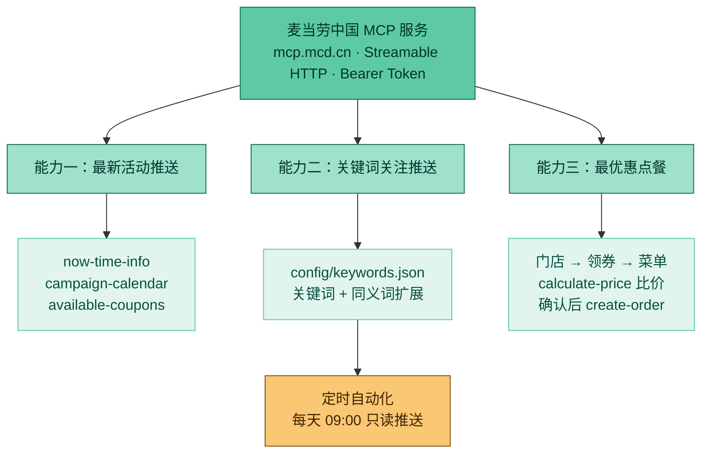

# mcd-cn-assistant

> 把麦当劳中国官方 MCP 的 35 个工具，封装成一个开箱即用的 Agent 技能：**活动不错过、优惠不放过、点餐不吃亏**。

[](https://open.mcd.cn/mcp)
[](https://open.mcd.cn/mcp)
[](./LICENSE)
[](./SKILL.md)

---

## 一、项目介绍

### 1.1 这是什么

`mcd-cn-assistant` 是一个**面向 AI Agent 的技能包（Skill）**，建立在**麦当劳中国官方 MCP 服务**（<https://mcp.mcd.cn>）之上。

麦当劳中国官方 MCP 提供了 30+ 个原子工具——查门店、查菜单、查券、领券、算价、下单、查积分、积分商城、积分抽奖、主题活动预约……但**原子工具不等于能用的助手**。直接用这些工具，用户需要自己记住几十个工具名、自己判断先调哪个后调哪个、自己组合券和商品算最便宜的方案，还得时刻提防 AI 擅自下单。

本项目做的事情是：**把这堆原子工具编排成三条用户真正会用的业务流**，并把安全边界写死。

### 1.2 解决什么问题

| 用户的真实困扰 | 本项目的解法 |
|---|---|
| "这个月麦当劳有什么活动？" ——活动散落在 App 各处，懒得翻 | **能力一**：一句话拉出当月活动日历，按「进行中 / 即将开始」分组摘要 |
| "我就想盯联名款，别的别烦我" ——原生工具只会返回全量活动 | **能力二**：自定义关键词 + 同义词扩展，只推命中项，还能每天定时自动推 |
| "到底怎么点最便宜？" ——券有门槛、有第二份半价、有满减，人脑算不过来 | **能力三**：围绕券的适用条件枚举候选组合，**逐个真算价**再比价，主推应付金额最低方案 |
| "AI 会不会自己把我钱花了？" | **设计红线**：任何下单 / 领券 / 取消 / 抽奖等写操作，必须先列明细并获得用户显式同意 |

### 1.3 三大能力

| 能力 | 触发场景 | 核心编排 |
|---|---|---|
| **① 最新活动推送** | "最近有什么活动""麦当劳有什么优惠" | `now-time-info` → `campaign-calendar` →（可选）`available-coupons` |
| **② 关键词关注推送** | "关注一下联名""每天推给我" | 读 `config/keywords.json` → 拉活动 → 关键词+同义词命中筛选 → 只推命中项 |
| **③ 最优惠点餐** | "怎么点最划算""帮我点个到店取" | 定位门店 → 盘券 → 看菜单 → 枚举组合 → **逐个 `calculate-price`** → 比价 → 确认后下单 |

### 1.4 架构



### 1.5 目标用户

**核心用户**

| 用户画像 | 他们的诉求 |
|---|---|
| 麦当劳高频用户 / "麦门"爱好者 | 每周多次消费，关心活动与优惠，想用最少的钱吃到想吃的 |
| 联名 / IP 收集型用户 | 只为特定联名或限定周边消费，怕错过开售时间，需要"只推我关心的" |
| 团餐 / 拼单决策者 | 公司团餐、办公室拼单、家庭点餐，需要快速算出多人份的最省组合 |
| 偶尔想吃但怕买贵的人 | 不确定券怎么用、套餐怎么搭最划算，希望有人直接给结论 |

**典型痛点**

- 活动散落在 App 首页、公众号、门店海报，**看到时往往已经结束**；
- 优惠券种类多、门槛各异（满减 / 第二份半价 / 指定商品 / 限渠道），**靠人脑判断哪种买法最便宜成本极高**；
- AI 助手能查菜单，但用户**不敢让它下单**——怕它算错价、用错券、多花钱。

**适用环境**

- 任意支持 MCP 的 AI 客户端（WorkBuddy / Claude Code / Cursor / Cline / Cherry Studio / Trae / Kiro / VSCode Copilot 等）；
- 需自备一枚麦当劳中国 MCP Token；
- 仅面向中国大陆地区（麦当劳 MCP 服务不含港澳台）。

---

## 二、仓库结构

```
mcd-cn-assistant/
├── README.md                  # 项目介绍 / 安装方法 / 使用示例 / 目标用户
├── CONTEST_DECLARATION.md     # 参赛声明（官方文件，内容未改动）
├── MCP_INTEGRATION.md         # MCP 集成说明：Server / Tool / 调用流程 / 业务价值
├── mcp-config.example.json    # 脱敏配置示例（仅环境变量占位符）
├── workbuddy.md               # WorkBuddy 开发上下文（WorkBuddy 专项奖励用）
├── SKILL.md                   # 技能主体（Agent 运行时加载）
├── LICENSE                    # MIT
├── config/
│   └── keywords.json          # 关注关键词配置（能力二读取）
├── references/
│   └── mcd-tools.md           # 35 个 MCP 工具速查表 + 调用顺序 + 错误码
└── docs/
    ├── mcp-setup.md           # MCP 接入说明（WorkBuddy / Cursor / Cherry Studio / Trae / Claude Code …）
    └── examples.md            # 三大能力的真实对话示例
```

---

## 三、安装方法

前置条件：已取得**麦当劳中国 MCP Token**（在 <https://open.mcd.cn/mcp> 手机号登录 → 控制台 → 激活 → 复制）。

**第 1 步：配置 MCP 服务（WorkBuddy 官方流程）**

1. 打开 WorkBuddy，在左侧边栏【**专家·技能·连接器**】，选中【**连接器**】页签；
2. 点击右上角【**自定义连接器**】→【**配置MCP**】；
3. 在打开的手动配置页面中填入以下的 JSON 内容：

   ```json
   {
     "mcpServers": {
       "mcd-mcp": {
         "type": "streamablehttp",
         "url": "https://mcp.mcd.cn",
         "headers": {
           "Authorization": "Bearer ${MCD_MCP_TOKEN}"
         }
       }
     }
   }
   ```

   > ⚠️ **一定记得把 `${MCD_MCP_TOKEN}` 替换为「你自己的」实际 MCP Token，点击【保存】！**
   >
   > 填入后请确认 `Authorization` 的值已经是你的真实 Token（形如 `Bearer abc123...`）——**WorkBuddy 手动配置页填入的是字面值**，不要保留 `${MCD_MCP_TOKEN}` 这个写法本身。

4. 回到【**自定义连接器**】，将 `mcd-mcp`【**启用**】。

其他客户端（Cursor / Cherry Studio / Trae / VSCode / Claude Code）见 **[docs/mcp-setup.md](./docs/mcp-setup.md)**。

> 📌 **关于占位符**：本仓库**不含任何真实凭证**，所有出现 `${MCD_MCP_TOKEN}`、`<你的 MCP Token>` 的位置**都需要你填入自己的 MCP Token**。其中 [`mcp-config.example.json`](./mcp-config.example.json) 是**脱敏示例**，按赛事要求只使用环境变量占位符，**不要**把真实 Token 写进去。完整对照见 [docs/mcp-setup.md · 占位符速查](./docs/mcp-setup.md#占位符速查)。

**第 2 步：安装技能**

把本仓库的 `SKILL.md`、`config/`、`references/` 放进你所用客户端的技能目录。推荐直接 clone：

```bash
git clone https://github.com/<your-name>/mcd-cn-assistant.git ~/.workbuddy/skills/mcd-cn-assistant
```

各客户端的技能目录：

| 客户端 | 技能目录 | 说明 |
|---|---|---|
| **WorkBuddy** | `~/.workbuddy/skills/` | 用户级技能，全局可用；也可放项目内 `.workbuddy/skills/` |
| Claude Code | `~/.claude/skills/` | 用户级技能 |
| 其他 MCP 客户端 | 以客户端文档为准 | 支持技能 / Rules 机制的目录 |

> 若你的客户端不支持技能目录机制，也可直接把 `SKILL.md` 的内容作为系统提示词或项目 Rules 粘贴进去，流程完全一致。

**第 3 步：验证**

对 Agent 说一句：

> 用 mcd-cn-assistant 查一下这个月麦当劳有什么活动

能正常返回活动列表即接入成功。若报 `401`，说明 Token 无效或未提供；若报 `429`，说明触发了 600 次/分钟的限流。

---

## 四、使用示例

### 能力一 · 最新活动推送

> **你**：这个月麦当劳有什么活动？
>
> **Agent**：先取当前时间 → 调用活动日历 → 输出「进行中 / 即将开始」分组清单，每条含活动名、起止时间、一句话参与方式和入口。

### 能力二 · 关键词关注推送

> **你**：帮我盯着联名款，有新的就告诉我
>
> **Agent**：把 `联名` 写入 `config/keywords.json`（含同义词：合作款 / 联名款 / IP合作 / 品牌合作），并回显最新关键词列表。之后每天 09:00 自动查询当月活动，只推命中项；没有命中就明确说「今日无命中关键词的新活动」，不拿无关活动凑数。

> **你**：不再关注联名了，改成关注新品
>
> **Agent**：更新配置文件 → 回显最新列表。

### 能力三 · 最优惠点餐

> **你**：两个人吃，到店取，怎么点最划算？我在静安寺附近
>
> **Agent**：
> 1. 查附近门店 → 2. 查麦麦省可领券 + 我已有的券 + 该门店可用券 → 3. 拉菜单 →
> 4. 围绕券的门槛枚举 2~5 个候选组合 → 5. **逐个调 `calculate-price` 真算** → 6. 输出比价表：
>
> | 方案 | 商品组合 | 使用券 | 商品金额 | 优惠 | 应付 |
> |---|---|---|---|---|---|
> | ✅ 最省 | … | 满 39 减 8 | ¥41.00 | -¥8.00 | **¥33.00** |
> | 备选 | … | 第二份半价 | ¥45.50 | -¥7.25 | ¥38.25 |
>
> 7. 你说「就第一个」，才调 `create-order` 下单。

更多示例见 **[docs/examples.md](./docs/examples.md)**。

---

## 五、MCP 接入说明

麦当劳中国 MCP 是**远程托管的 MCP Server**，无需本地安装任何进程，只需配置接入地址与 Token。

| 项目 | 值 |
|---|---|
| 接入地址 | `https://mcp.mcd.cn` |
| 传输协议 | Streamable HTTP（不支持 WebSocket） |
| 鉴权 | 请求头 `Authorization: Bearer <你的 MCP Token>` |
| 工具数量 | 35 个（2026-10-09 对线上 `tools/list` 实测核对） |
| 限流 | 每 Token 600 次/分钟，超限返回 `429` |
| 覆盖范围 | 中国大陆（不含港澳台） |

**平台接入教程**（WorkBuddy / Cursor / Cherry Studio / Trae / VSCode 等）→ **[docs/mcp-setup.md](./docs/mcp-setup.md)**
**工具清单与调用顺序** → **[references/mcd-tools.md](./references/mcd-tools.md)**

---

## 六、设计原则与安全边界

这是本项目区别于"把工具列表塞给模型"的核心：

1. **写操作必须二次确认。** `create-order`、`auto-bind-coupons`、`cancel-order`、`draw-lottery`、`mall-create-order`、`party-order-create`、`delivery-create-address` 等会花钱、耗积分或改变账户状态的调用，**必须先向用户列清明细并获得明确同意**，严禁静默执行。
2. **算价不靠心算。** 一切金额以 `calculate-price` 的返回为准。券面文字不等于真实优惠（门槛、渠道、指定商品都会影响），必须真跑一遍。
3. **时间不靠模型记忆。** 涉及日期一律调用 `now-time-info`。
4. **限流友好。** 串行调用、复用会话内已获取的结果，不做无意义的重复查询。
5. **只做该做的事。** 定时推送任务被明确限定为"只读"，prompt 中写死禁止任何写操作。

---

## 七、参赛信息

本项目是**麦当劳程序员创意开发大赛**的参赛作品。

| 项目 | 内容 |
|---|---|
| 赛事名称 | 麦当劳程序员创意开发大赛 |
| 主办方 | 金拱门（中国）有限公司 |
| 报名及排名时间 | 2026 年 10 月 9 日 10:30 — 10 月 25 日 23:59（北京时间） |
| 奖品兑换及信息提交截止 | 2026 年 11 月 14 日 |
| 排名依据 | 项目在 GitHub 获得的**公开 Star 数**（Star 数为 0 不进入排行榜） |
| 参赛声明 | [CONTEST_DECLARATION.md](./CONTEST_DECLARATION.md)（官方文件，内容未做任何改动） |

**提交文件清单（按赛事要求）**

| 文件 | 赛事要求 | 本项目状态 |
|---|---|---|
| `README.md` | 项目介绍、安装方法、使用示例、目标用户 | ✅ |
| `CONTEST_DECLARATION.md` | 参赛声明，文件名与内容均不可改动 | ✅ 官方原文件，MD5 校验一致 |
| `MCP_INTEGRATION.md` | 说明实际使用的 MCP Server、Tool、调用流程和业务价值 | ✅ |
| `mcp-config.example.json` | 脱敏后的配置示例，只允许环境变量占位符 | ✅ 仅含 `${MCD_MCP_TOKEN}` |
| `workbuddy.md` | WorkBuddy 专项奖励所需 | ✅ |
| 源代码 | 项目主体代码或可运行内容 | ✅ `SKILL.md` + `config/` + `references/` |

> 如果这个项目帮你省下了一顿饭钱，欢迎点一个 ⭐ Star 支持一下。

---

## 八、兼容性

技能本身不绑定任何特定的 Agent 框架。`SKILL.md` 与 `references/mcd-tools.md` 全程使用**官方工具名**（`query-meals`、`calculate-price` 等）描述流程，因此可接入任何支持 MCP 的框架：

Claude Code · Cursor · Cline · Cherry Studio · Trae · Kiro · VSCode Copilot · WorkBuddy 等。

> 注：`config/keywords.json` 的读写由 Agent 直接编辑文件完成；若你的框架无文件系统权限，可把关键词直接写在对话上下文里，技能流程同样成立。

---

## 九、免责声明

- 本项目是**麦当劳程序员创意开发大赛参赛作品**，由参赛者独立开发，**非麦当劳官方产品**；项目输出仅供参考，不构成医疗、营养或其他专业建议；餐品信息、价格及供应状态以麦当劳官方渠道的实时结果为准。
- 本项目是**第三方社区作品**，由个人开发者独立编写，**与麦当劳中国及其关联方无隶属、代理、赞助或背书关系**。
- 本项目**不包含也不分发**麦当劳 MCP 的任何源码、Token 或私密数据；MCP 服务的使用须遵守麦当劳中国的《使用条款》及《麦当劳 MCP 服务规则》，Token 需使用者自行申请并妥善保管。
- 本项目**不构成对麦当劳及其关联方商标、标识、品牌资产的任何授权**。
- 本项目仅用于个人学习与非商业用途，不得用于商业售卖、付费分发、引流变现，或任何暗示官方背书、误导公众的用途，亦不得用于违法违规或黑灰产行为。
- 本项目按"现状"提供，不构成任何形式的保证或承诺；因使用本项目产生的任何后果由使用者自行承担。
- 下单、领券、抽奖等操作会真实产生费用或消耗账户权益，请务必在确认明细后再执行。

---

## 十、License

[MIT](./LICENSE) © 2026 mcd-cn-assistant contributors

麦当劳、McDonald's、麦乐送、麦麦省等商标归麦当劳及其关联方所有。
